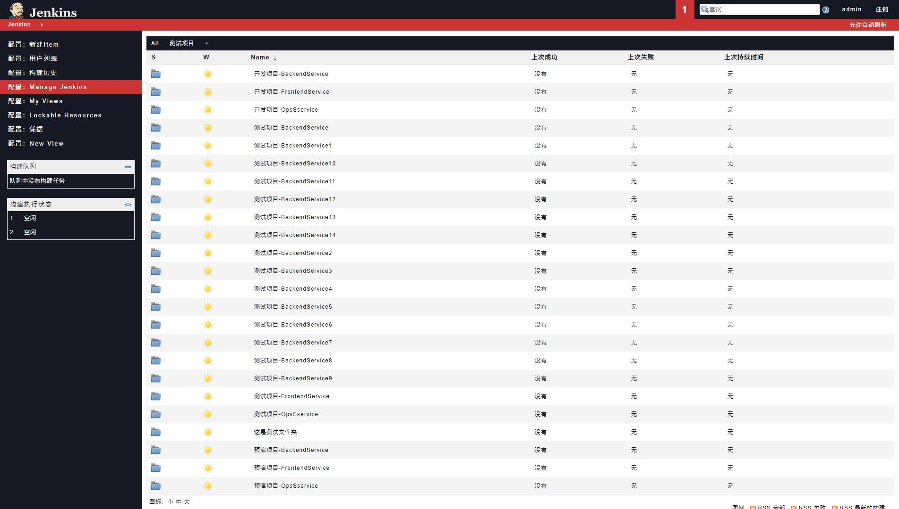
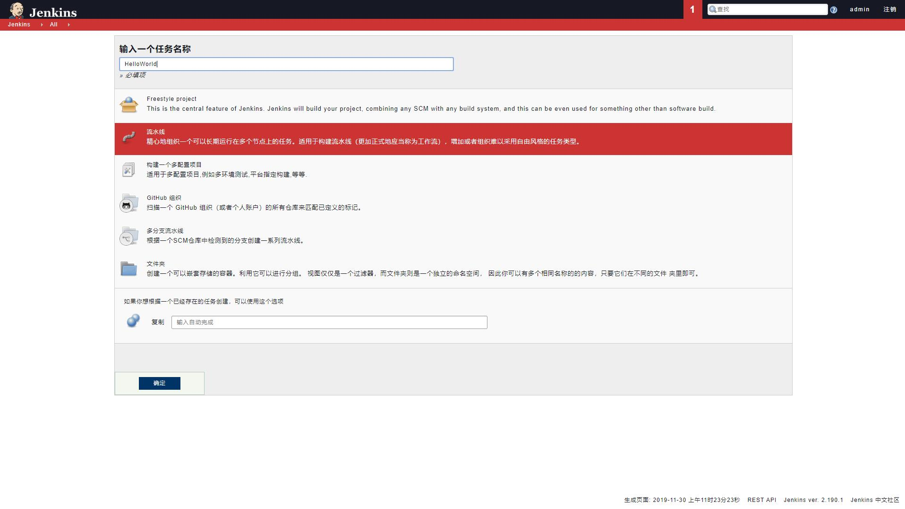
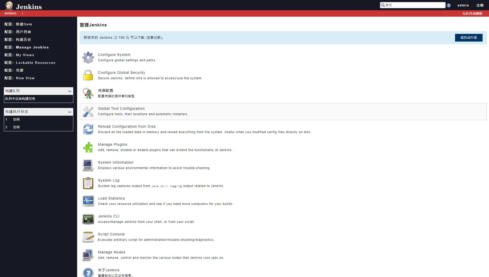
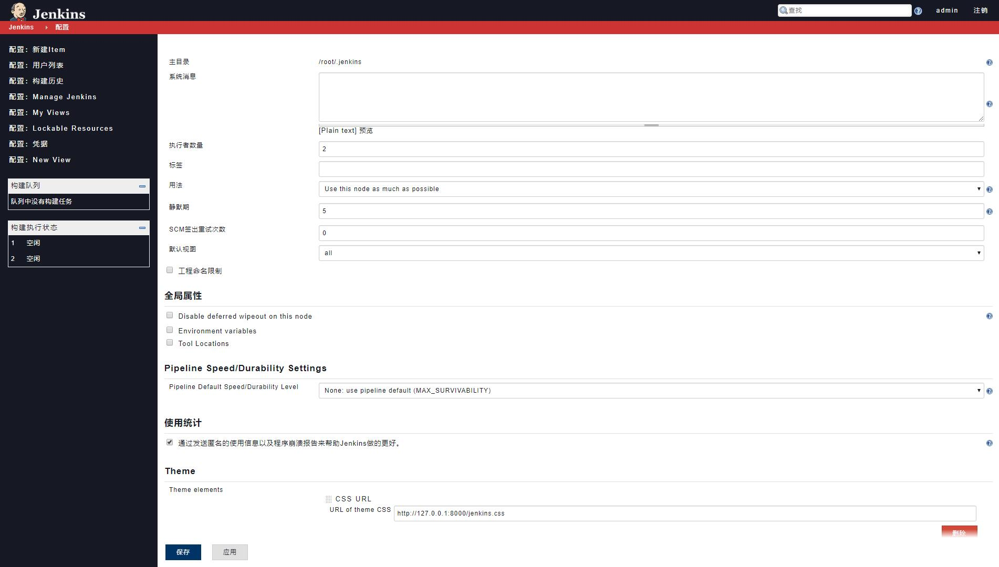
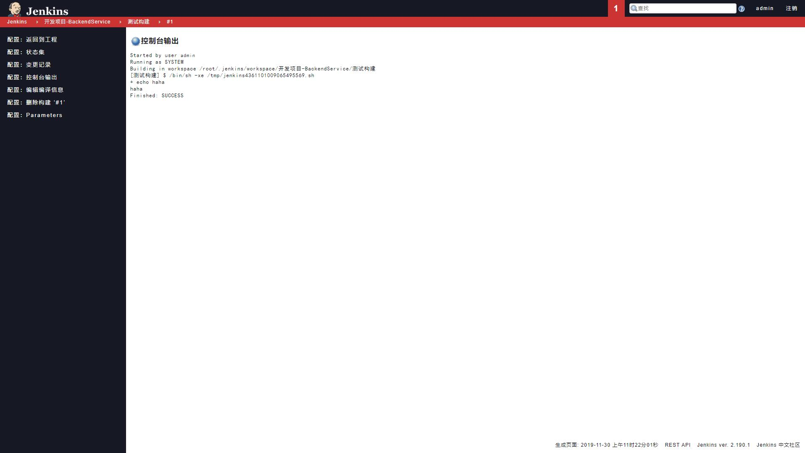

## 项目名称

这款主题取名为：刀锋
至于取这个名字的一个原因是样式中尽可能的去掉了 border-radius 参数，所以有很多棱棱角角，显得很硬朗。
另一个原因则是因为帅！

## 项目说明

之前提交过一版，但是因为后来发现有些地方处理的不好，于是抽空重写了一版。自己不是前端，所以也就只能是随便写写，将就能用就行。当然，BUG 肯定是不少了，很多测试没法覆盖到，欢迎提出。
关于更多的运维相关文章，可以看我的博客园：[博客园](https://www.cnblogs.com/Dy1an "博客园")

## Jenkins任何使用主题？

* Jenkins 在安装之后需要安装插件：Simple Theme Plugin
* 安装插件之后重启 Jenkins，然后在 [系统管理] --> [系统设置] --> [Theme] --> [Extra CSS]
* 将我们的 jenkins.css 文件中的内容粘贴到此处即可

## 最终效果

主页：

新建项目：

配置管理：

配置详情：

控制台输出：

## 其他说明

BUG 肯定是有的，兼容性问题也有，欢迎反馈！